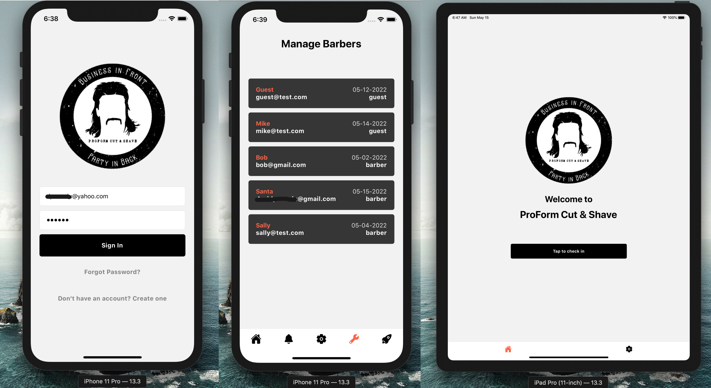

# VizView

## A visitor management appplication

Primary purpose is to provide a quick and easy check-in service for guests (ex. iPad in front lobby) and push notifications are sent to the employees.

Built with React Native Expo and it utilizes Firebase for the backend services and works on iOS and Android. Users can signup/signin and there are three user roles, each with varying account privileges/restrictions and screen views.

Admins can add/remove users from the list of barbers that appears on the check-in form for guests, change authorization codes, and has full application access.

Barbers can view their specific guest check-in notifications and has access to basic account settings, such as updating username, email, password, and account deletion.

Guest accounts can check-in via the checkin form and also has access to basic settings.

